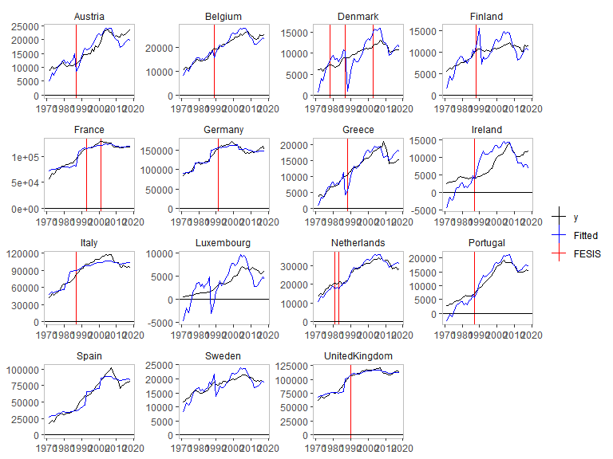
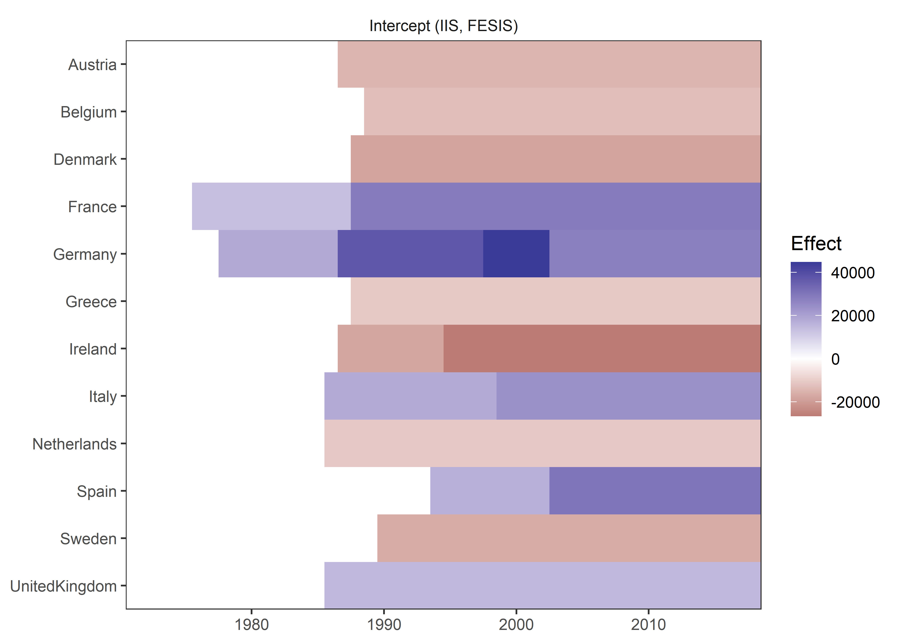
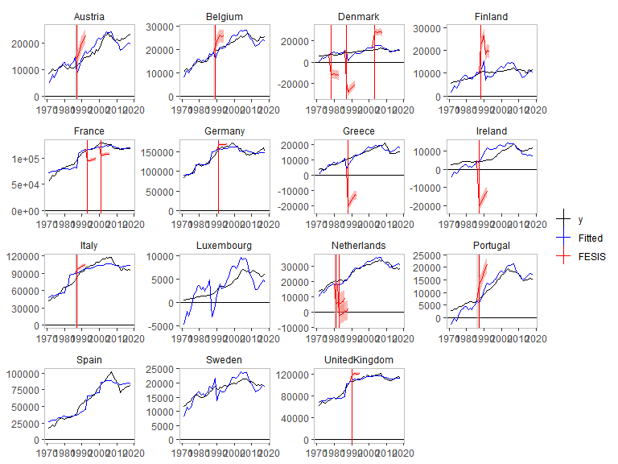
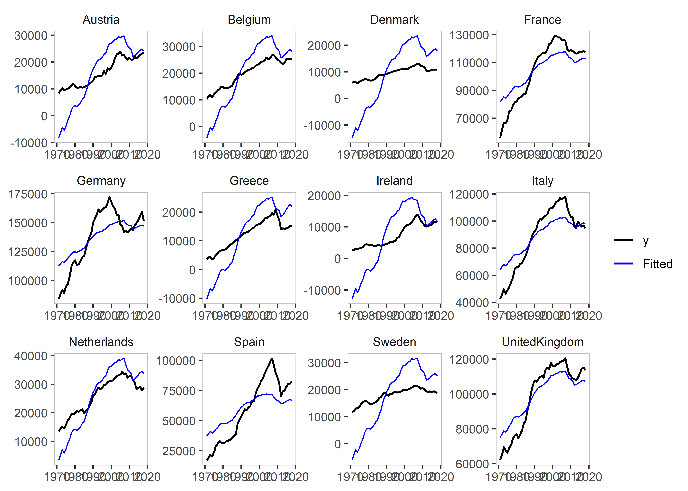
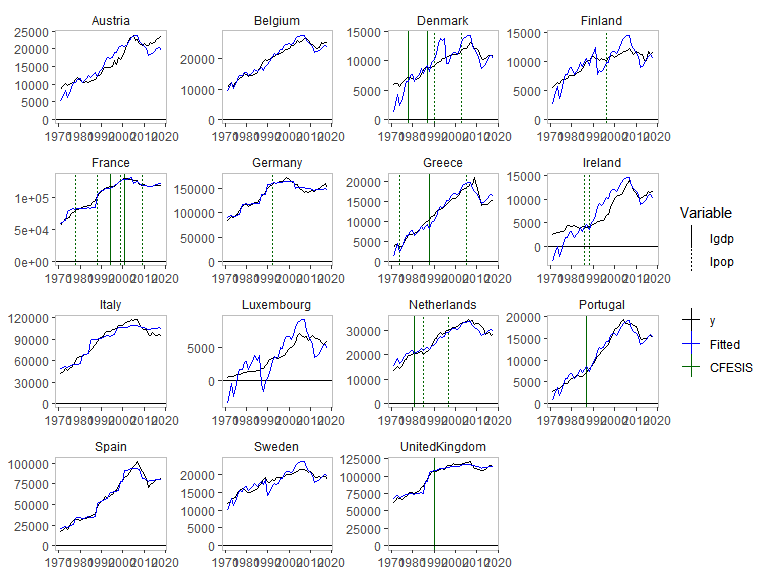
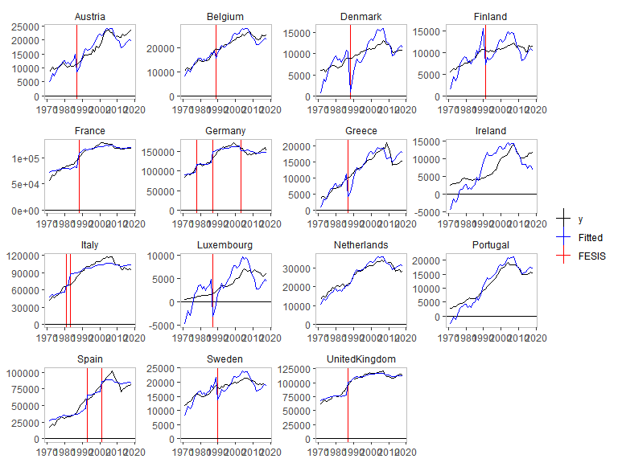

<!-- README.md is generated from README.Rmd. Please edit that file -->

# getspanel

<!-- badges: start -->

[](https://github.com/moritzpschwarz/getspanel/actions)
[](https://CRAN.R-project.org/package=getspanel)
<!-- badges: end -->

The package is a panel adaptation of the gets package see [see
here](https://CRAN.R-project.org/package=gets).

This code is being developed by Felix Pretis and Moritz Schwarz. The
associated working paper is published under “Panel Break Detection:
Detecting Unknown Treatment, Stability, Heterogeneity, and Outliers” by
Pretis and Schwarz, which is available at SSRN
[here](https://papers.ssrn.com/sol3/papers.cfm?abstract_id=4022745) and
was applied to a study by Nico Koch and colleagues on EU Road
CO<sub>2</sub> emissions, which was [published in Nature Energy in
2022](https://www.nature.com/articles/s41560-022-01095-6).

## Installation

You can install the released version of getspanel from
[CRAN](https://CRAN.R-project.org) with:

``` r
install.packages("getspanel")
```

And the development version from [GitHub](https://github.com/) with:

``` r
# install.packages("devtools")
devtools::install_github("moritzpschwarz/getspanel")
```

## Example

``` r
library(getspanel)

data("EU_emissions_road")
# let's subset a few countries to make this faster
subset <- c("Austria", "Belgium", "Germany", "Denmark", "Spain", 
                 "France",  "Greece", "Ireland", "Italy", "Netherlands", "Sweden", "United Kingdom")

EU_emissions_road <- EU_emissions_road[EU_emissions_road$country %in% subset, ]

is1 <- isatpanel(data = EU_emissions_road,
                 formula = transport.emissions ~ lgdp + lpop, 
                 index = c("country","year"),
                 effect = "twoways",
                 fesis = TRUE,
                 
                 print.searchinfo = FALSE # to save space we suppress the status information in the estimation
)
Loading required namespace: gets
```

``` r
is1

Date: Fri Jan 27 15:29:09 2023 
Dependent var.: y 
Method: Ordinary Least Squares (OLS)
Variance-Covariance: Ordinary 
No. of observations (mean eq.): 576 
Sample: 1 to 576 

SPECIFIC mean equation:

                             coef std.error   t-stat   p-value    
lgdp                     16166.01   3698.62   4.3708 1.509e-05 ***
lpop                    -20201.86  10799.14  -1.8707 0.0619766 .  
idBelgium                 4000.22   2640.51   1.5149 0.1304241    
idDenmark               -10845.73   4359.12  -2.4881 0.0131716 *  
idFrance                 66188.67  17508.65   3.7803 0.0001757 ***
idGermany                96272.86  20912.34   4.6036 5.282e-06 ***
idGreece                  2817.26   3132.58   0.8993 0.3689070    
idIreland                -2658.34   6880.04  -0.3864 0.6993776    
idItaly                  58752.06  17821.58   3.2967 0.0010485 ** 
idNetherlands             8562.85   5385.59   1.5900 0.1124814    
idSpain                  33677.26  14651.99   2.2985 0.0219497 *  
idSweden                   530.17   1505.34   0.3522 0.7248433    
idUnitedKingdom          74109.40  17971.66   4.1237 4.371e-05 ***
time1971                -93833.18 128577.79  -0.7298 0.4658707    
time1972                -92624.47 128613.12  -0.7202 0.4717540    
time1973                -91506.49 128640.52  -0.7113 0.4772111    
time1974                -92809.71 128679.42  -0.7212 0.4710971    
time1975                -91394.63 128722.81  -0.7100 0.4780309    
time1976                -91124.39 128743.15  -0.7078 0.4794020    
time1977                -89888.88 128771.65  -0.6980 0.4854738    
time1978                -89589.36 128829.40  -0.6954 0.4871236    
time1979                -88915.27 128852.38  -0.6901 0.4904822    
time1980                -88877.13 128882.84  -0.6896 0.4907706    
time1981                -89182.08 128916.46  -0.6918 0.4893980    
time1982                -88663.53 128934.20  -0.6877 0.4919852    
time1983                -88159.12 128943.82  -0.6837 0.4944828    
time1984                -87325.32 128948.20  -0.6772 0.4985869    
time1985                -87069.20 128951.95  -0.6752 0.4998592    
time1986                -87107.37 128982.22  -0.6753 0.4997720    
time1987                -84505.33 129007.82  -0.6550 0.5127454    
time1988                -81052.83 128991.08  -0.6284 0.5300574    
time1989                -78570.84 129025.01  -0.6090 0.5428309    
time1990                -75690.17 129052.59  -0.5865 0.5578021    
time1991                -74748.84 129094.31  -0.5790 0.5628352    
time1992                -73233.68 129137.90  -0.5671 0.5709050    
time1993                -72308.53 129181.74  -0.5597 0.5759077    
time1994                -73875.92 129191.56  -0.5718 0.5676946    
time1995                -73018.31 129151.13  -0.5654 0.5720771    
time1996                -72144.60 129169.49  -0.5585 0.5767369    
time1997                -72079.39 129182.02  -0.5580 0.5771182    
time1998                -71319.91 129195.70  -0.5520 0.5811764    
time1999                -70971.83 129234.39  -0.5492 0.5831350    
time2000                -71458.66 129252.29  -0.5529 0.5806071    
time2001                -71093.29 129287.58  -0.5499 0.5826458    
time2002                -70620.12 129332.12  -0.5460 0.5852860    
time2003                -70244.19 129386.95  -0.5429 0.5874424    
time2004                -69754.87 129430.26  -0.5389 0.5901715    
time2005                -70463.80 129480.18  -0.5442 0.5865447    
time2006                -70448.29 129526.82  -0.5439 0.5867618    
time2007                -70673.44 129581.24  -0.5454 0.5857245    
time2008                -72625.71 129645.08  -0.5602 0.5756036    
time2009                -73646.87 129713.53  -0.5678 0.5704511    
time2010                -74469.83 129746.95  -0.5740 0.5662536    
time2011                -75277.18 129769.49  -0.5801 0.5621215    
time2012                -77342.82 129804.50  -0.5958 0.5515534    
time2013                -76958.54 129839.27  -0.5927 0.5536376    
time2014                -76505.27 129870.02  -0.5891 0.5560684    
time2015                -76179.65 129898.07  -0.5865 0.5578351    
time2016                -75655.80 129937.92  -0.5822 0.5606657    
time2017                -75528.82 129969.34  -0.5811 0.5614182    
time2018                -76549.16 129999.52  -0.5888 0.5562354    
fesisAustria.1987       -14752.52   1654.35  -8.9174 < 2.2e-16 ***
fesisBelgium.1989       -12941.87   1596.28  -8.1075 4.072e-15 ***
fesisGermany.1978        18284.76   2048.76   8.9248 < 2.2e-16 ***
fesisGermany.1987        19086.84   2032.35   9.3915 < 2.2e-16 ***
fesisGermany.1998         7350.67   2158.87   3.4049 0.0007156 ***
fesisGermany.2003       -16943.32   2116.72  -8.0045 8.574e-15 ***
fesisDenmark.1988       -18253.66   1644.62 -11.0990 < 2.2e-16 ***
fesisSpain.1994          16853.70   1782.70   9.4541 < 2.2e-16 ***
fesisSpain.2003          13298.86   1734.13   7.6689 9.236e-14 ***
fesisFrance.1976         13435.71   2113.43   6.3573 4.661e-10 ***
fesisFrance.1988         15148.31   1763.04   8.5921 < 2.2e-16 ***
fesisUnitedKingdom.1986  14711.60   1686.10   8.7252 < 2.2e-16 ***
fesisGreece.1988        -10814.35   1814.16  -5.9611 4.761e-09 ***
fesisIreland.1987       -17863.87   1999.58  -8.9338 < 2.2e-16 ***
fesisIreland.1995        -8728.46   2241.13  -3.8947 0.0001118 ***
fesisItaly.1986          18109.81   1836.05   9.8635 < 2.2e-16 ***
fesisItaly.1999           5542.89   1534.77   3.6116 0.0003354 ***
fesisNetherlands.1986   -10588.43   1689.90  -6.2657 8.062e-10 ***
fesisSweden.1990        -16740.92   1560.10 -10.7307 < 2.2e-16 ***
---
Signif. codes:  0 '***' 0.001 '**' 0.01 '*' 0.05 '.' 0.1 ' ' 1

Diagnostics and fit:

                  Chi-sq df   p-value    
Ljung-Box AR(1)   273.47  1 < 2.2e-16 ***
Ljung-Box ARCH(1) 203.28  1 < 2.2e-16 ***
---
Signif. codes:  0 '***' 0.001 '**' 0.01 '*' 0.05 '.' 0.1 ' ' 1
                            
SE of regression  3787.68635
R-squared            0.99428
Log-lik.(n=576)  -5523.26673
```

``` r
plot(is1)
```



Let’s explore the other plots that we can use:

``` r
plot_grid(is1)
```



We can plot the counterfactuals as well:

``` r
plot_counterfactual(is1, plus_t = 5)
```



We can plot the residuals against an OLS model:

``` r
plot_residuals(is1)
```


An example using coefficient step indicator saturation and impulse
indicator saturation:

``` r
is2 <- isatpanel(data = EU_emissions_road,
                 formula = transport.emissions ~ lgdp + lpop, 
                 index = c("country","year"),
                 effect = "twoways",
                 csis = TRUE, 
                 iis = TRUE,  
                 print.searchinfo = FALSE # to save space we suppress the status information in the estimation
)
```

``` r
is2     

Date: Fri Jan 27 15:31:38 2023 
Dependent var.: y 
Method: Ordinary Least Squares (OLS)
Variance-Covariance: Ordinary 
No. of observations (mean eq.): 576 
Sample: 1 to 576 

SPECIFIC mean equation:

                     coef std.error  t-stat   p-value    
lgdp             -1309.59   5200.07 -0.2518 0.8012641    
lpop            -19713.06  18182.85 -1.0842 0.2788025    
idBelgium         9344.72   4456.79  2.0967 0.0365039 *  
idDenmark       -14714.45   7266.18 -2.0251 0.0433767 *  
idFrance        130800.79  30255.98  4.3231 1.847e-05 ***
idGermany       170095.59  34685.82  4.9039 1.262e-06 ***
idGreece           920.57   6102.51  0.1509 0.8801518    
idIreland       -24556.72  10798.40 -2.2741 0.0233701 *  
idItaly         113904.80  29959.95  3.8019 0.0001608 ***
idNetherlands    23780.80   9735.94  2.4426 0.0149178 *  
idSpain          77098.98  25550.27  3.0175 0.0026744 ** 
idSweden          4113.59   2449.85  1.6791 0.0937360 .  
idUnitedKingdom 125238.32  30372.14  4.1235 4.350e-05 ***
time1971        337573.55 212025.05  1.5921 0.1119668    
time1972        339667.96 212047.13  1.6019 0.1098017    
time1973        341774.30 212049.80  1.6118 0.1076259    
time1974        340827.37 212103.40  1.6069 0.1086908    
time1975        342319.90 212178.45  1.6134 0.1072792    
time1976        344453.70 212185.76  1.6234 0.1051245    
time1977        346175.55 212214.20  1.6313 0.1034478    
time1978        348560.87 212233.20  1.6423 0.1011282    
time1979        349821.30 212246.78  1.6482 0.0999252 .  
time1980        350130.80 212289.04  1.6493 0.0996936 .  
time1981        349850.02 212348.93  1.6475 0.1000603    
time1982        350556.90 212372.10  1.6507 0.0994150 .  
time1983        351326.17 212376.83  1.6543 0.0986843 .  
time1984        352617.08 212362.73  1.6604 0.0974332 .  
time1985        353327.57 212347.60  1.6639 0.0967385 .  
time1986        355549.70 212341.16  1.6744 0.0946539 .  
time1987        357446.66 212336.68  1.6834 0.0929045 .  
time1988        360407.35 212310.28  1.6976 0.0901968 .  
time1989        362433.36 212303.25  1.7071 0.0883970 .  
time1990        364443.78 212327.77  1.7164 0.0866864 .  
time1991        365699.26 212388.28  1.7218 0.0856984 .  
time1992        367440.24 212456.52  1.7295 0.0843216 .  
time1993        368344.48 212537.31  1.7331 0.0836798 .  
time1994        368733.81 212546.04  1.7348 0.0833671 .  
time1995        369413.53 212548.84  1.7380 0.0828055 .  
time1996        370723.06 212560.90  1.7441 0.0817419 .  
time1997        371431.92 212552.15  1.7475 0.0811491 .  
time1998        373440.00 212544.32  1.7570 0.0795123 .  
time1999        374926.57 212536.25  1.7641 0.0783148 .  
time2000        375183.25 212531.99  1.7653 0.0781055 .  
time2001        375960.72 212575.83  1.7686 0.0775533 .  
time2002        376750.81 212641.21  1.7718 0.0770244 .  
time2003        377108.67 212712.58  1.7729 0.0768437 .  
time2004        378138.04 212764.59  1.7773 0.0761156 .  
time2005        377829.39 212835.61  1.7752 0.0764526 .  
time2006        378465.72 212889.63  1.7778 0.0760340 .  
time2007        378767.26 212962.49  1.7786 0.0759012 .  
time2008        376797.02 213079.76  1.7683 0.0775964 .  
time2009        375029.37 213241.76  1.7587 0.0792215 .  
time2010        374489.45 213288.57  1.7558 0.0797191 .  
time2011        373808.44 213323.35  1.7523 0.0803158 .  
time2012        371578.43 213395.33  1.7413 0.0822338 .  
time2013        371965.53 213458.55  1.7426 0.0820064 .  
time2014        372764.83 213497.36  1.7460 0.0814085 .  
time2015        373719.63 213517.09  1.7503 0.0806615 .  
time2016        374587.80 213572.53  1.7539 0.0800401 .  
time2017        375180.68 213606.53  1.7564 0.0796127 .  
time2018        374569.33 213641.06  1.7533 0.0801515 .  
---
Signif. codes:  0 '***' 0.001 '**' 0.01 '*' 0.05 '.' 0.1 ' ' 1

Diagnostics and fit:

                  Chi-sq df   p-value    
Ljung-Box AR(1)   503.70  1 < 2.2e-16 ***
Ljung-Box ARCH(1) 429.87  1 < 2.2e-16 ***
---
Signif. codes:  0 '***' 0.001 '**' 0.01 '*' 0.05 '.' 0.1 ' ' 1
                            
SE of regression 10193.99274
R-squared            0.95699
Log-lik.(n=576)  -6103.03163
plot(is2)
```



``` r
plot_grid(is2)
Warning in plot_grid(is2): No indicators identified in the isatpanel object. No
plot produced.
```

and an example of Coefficient Fixed-Effect Step indicator saturation:

``` r
is3 <- isatpanel(data = EU_emissions_road,
                 formula = transport.emissions ~ lgdp + lpop, 
                 index = c("country","year"),
                 effect = "twoways",
                 cfesis = TRUE, 
                 print.searchinfo = FALSE # to save space we suppress the status information in the estimation
)
```

``` r
is3    
plot(is3)
```



We can also use e.g. the `fixest` package to estimate our models:

``` r
is4 <- isatpanel(data = EU_emissions_road,
                 formula = transport.emissions ~ lgdp + lpop, 
                 index = c("country","year"),
                 effect = "twoways",
                 engine = "fixest",
                 fesis = TRUE, 
                 print.searchinfo = FALSE # to save space we suppress the status information in the estimation
)
```

``` r
plot(is4)
```


