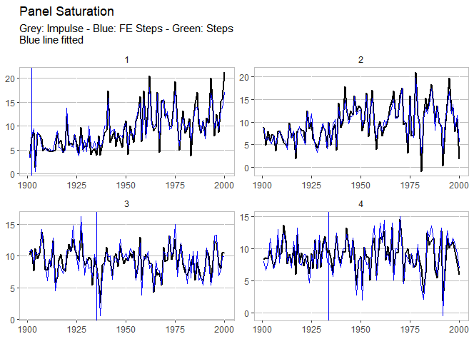

```{r, include = FALSE}
knitr::opts_chunk$set(
  collapse = TRUE,
  comment = "#>",
  echo = TRUE,
  message = FALSE,
  cache = TRUE,
  error=TRUE,
  eval=TRUE,
  fig.width = 7,
  fig.height = 5
)
```

The `getspanel` package can be downloaded and installed from [GitHub](https://github.com/moritzpschwarz/getspanel).

The package can be installed using:

    # install.packages("devtools")
    devtools::install_github("moritzpschwarz/getspanel")

Once installed we need to load the library:

```{r setup}
library(getspanel)
library(tidyverse) # needed for the plots
```

Currently the package is called **getspanel** to align with the **gets** package, but it's main function of course remains the **isatpanel** function.

**A quick overview over what has changed:**

-   We can now use the function approach as well as the traditional gets approach. This means that we can specify a model using `y` and `mxreg` as well as `time` and `id` as vectors, but we can now also simply supply a `data.frame` and a `function` in the form `y ~ x + z + I(x^2)` to e.g. specify polynomials. This means we will then need an `index` argument, which specifies the

-   The `ar` argument now works

-   We can now use the `fixest` package to speed up model estimation with large `i` (for short panels, the default method is still faster).The package can be activated using the new `engine` argument.

-   Using the `fixest` package also allows us to calculate **clustered standard errors**.

-   We can now be certain that unbalanced panels would work as intended, which was not the case before.

-   The `mxbreak` and `break.method` arguments have been removed. Instead the function now produces the break matrix itself. This now implements the following saturation methods in a user friendly way:

-   **iis**: Impulse Indicator Saturation

-   **jsis**: **Joint** Step Indicator Saturation (Common Breaks over time)

-   **csis**: **Coefficient** Step Indicator Saturation (Common Coefficient Breaks over time)

-   **fesis**: **Fixed Effect** Step Indicator Saturation (Breaks in the Group Fixed Effect over time)

-   **cfesis**: **Coefficient Fixed Effect** Step Indicator Saturation (Breaks in the coefficient for each individual)

# The isatpanel function

We first load the artificially created data[^1].

[^1]: This is based on the data created in the R code file "panel_demonstration_v5_shared.R".

```{r}
data("pandata_simulated")
head(pandata_simulated)
```

Let's look at how we input what we want to model. Each `isatpanel` command takes:

## Basics

-   A specification of the source data, the group and time variable and the group-time characteristics. This can be entered into the function in two ways:

i.  In the **gets** package style i.e. using vectors and matrices to specify `y`, `mxreg`, `time` and `id`

ii. But also in a form that resembles the `lm` and `plm` specification i.e. inputting a `data.frame` (or `matrix` or `tibble`), a `formula` argument as well as character vectors for `index` (in the form `c("group_variable_name", "time_variable_name")`)

-   A an argument for the Fixed Effect Specification using `effect`.

This already means that the following two commands will give the same result:

Using the new method

```{r, cache = TRUE}
is_lm <- isatpanel(data = pandata_simulated,
                   formula = gdp ~ temp, 
                   index = c("country","year"),
                   
                   effect = "twoways",
                   
                   fesis = TRUE)
```

Using the traditional method

```{r, cache = TRUE}
is_gets <- isatpanel(y = pandata_simulated$gdp,
                     mxreg = pandata_simulated$temp,
                     time = pandata_simulated$year,
                     id = pandata_simulated$country,
                     
                     effect = "twoways",
                     
                     fesis = TRUE)
```

<!-- Let's check if those yield the same outcome: -->

<!-- ```{r} -->

<!-- head(is_lm$isatpanel.result$mean.results) -->

<!-- ``` -->

<!-- ```{r} -->

<!-- head(is_gets$isatpanel.result$mean.results) -->

<!-- ``` -->

<!-- Evidently these are identical.  -->

From here onwards, I will use the `lm` notation.

## Plotting

We can plot these simply using the default plotting methods (rely on the **tidyverse** package):

```{r}
plot(is_lm)
```

<!--  -->

## Saturation Methods

### Impulse Indicator Saturation

This argument works just as in the **gets** package. The method simply adds a `0` and `1` dummy for each observation.

Simply set `iis = TRUE`.

```{r, cache = TRUE}
iis_example <- isatpanel(data = pandata_simulated,
                         formula = gdp ~ temp, 
                         index = c("country","year"),
                         
                         effect = "twoways",
                         
                         iis = TRUE)
```

### Step Indicator Saturation

Traditional Step Indicator Saturation does not make sense in a panel setting. Therefore, the **gets** function of `sis` is disabled.

### Joint Step Indicator Saturation

It is possible, however, to consider Step Indicator Saturation with common breaks across individuals. Such indicators would be collinear, if `effects = c("twoways")` or `effects = c("time")` i.e. if Time Fixed Effects are included.

If, however, `effect = "individual"` then we can use `jsis = TRUE` to select over all individual time fixed effects.

```{r, cache = TRUE}
jsis_example <- isatpanel(data = pandata_simulated,
                          formula = gdp ~ temp, 
                          index = c("country","year"),
                          
                          effect = "twoways",
                          
                          jsis = TRUE)
```

### Coefficient Step Indicator Saturation

**Note:** This method has only been tested using the `lm` implementation (using `data`, `formula`, and `index`).

This method allows detection of coefficient breaks that are common across all groups. It is the interaction between `jsis` and the relevant coefficient.

To illustrate this, as well as the advantages of using the `lm` approach, we include a non-linear term of the temperature variable using `I(temp^2)`:

```{r, cache = TRUE}
csis_example <- isatpanel(data = pandata_simulated,
                          formula = gdp ~ temp + I(temp^2), 
                          index = c("country","year"),
                          
                          effect = "twoways",
                          
                          csis = TRUE)
```

```{r}
plot(csis_example)
```

By default, all coefficients will be interacted and added to the indicator list - but his can be controlled using the `csis_var`, which takes a character vector of column names i.e. `csis_var = "temp"`.

```{r, cache = TRUE}
csis_example2 <- isatpanel(data = pandata_simulated,
                           formula = gdp ~ temp + I(temp^2), 
                           index = c("country","year"),
                           
                           effect = "twoways",
                           
                           csis = TRUE,
                           csis_var = "temp")
```

### Fixed Effect Step Indicator Saturation

This is equivalent to supplying a constant to the mxbreak argument in the old method. This essentially breaks the group-specific intercept i.e. the individual fixed effect.

```{r, cache = TRUE}
fesis_example <- isatpanel(data = pandata_simulated,
                           formula = gdp ~ temp + I(temp^2), 
                           index = c("country","year"),
                           
                           effect = "twoways",
                           
                           fesis = TRUE)

```

Similar to the `csis_var` idea, we can specify the `fesis` method for a subset of individuals as well using the `fesis_id` variable, which takes a character vector of individuals. In this case we can use e.g. `fesis_id = c("2","3")`.

```{r, cache = TRUE}
fesis_example <- isatpanel(data = pandata_simulated,
                           formula = gdp ~ temp + I(temp^2), 
                           index = c("country","year"),
                           
                           effect = "twoways",
                           
                           fesis = TRUE,
                           fesis_id = c("2","3"))
```

### Coefficient Fixed Effect Step Indicator Saturation

This method combines the `csis` and the `fesis` approach and detects whether coefficients for individual units break over time.

This means we can also combine the subsetting in both the variable and in the individual units using `cfesis_id` and `cfesis_var`.

```{r, cache = TRUE}
cfesis_example <- isatpanel(data = pandata_simulated,
                            formula = gdp ~ temp + I(temp^2), 
                            index = c("country","year"),
                            
                            effect = "twoways",
                            
                            cfesis = TRUE,
                            cfesis_id = c("2","3"),
                            cfesis_var = "temp")
```

```{r}
plot(cfesis_example)
```

## The `ar` argument

It is now possible to specify an argument to include autoregressive coefficients, using the `ar` argument.

```{r, cache = TRUE}
fesis_ar1_example <- isatpanel(data = pandata_simulated,
                               formula = gdp ~ temp + I(temp^2), 
                               index = c("country","year"),
                               
                               effect = "twoways",
                               
                               fesis = TRUE,
                               
                               ar = 1)
```

## Post-selection robustness

The options for the `robust.isatpanel` are to use HAC Standard Errors, use a standard White Standard Error Correction (with the option of clustering the S.E. within groups or time):

```{r}
robust.isatpanel(fesis_ar1_example, HAC = TRUE, robust = TRUE, cluster = "group")
```

## The `engine` argument

Another new argument is also the `engine` argument. This allows us to use an external package to estimate our models. At this stage, the **fixest** package can be used.

This also means that we can now use an argument to cluster Standard Errors using `cluster`.

```{r, cache = TRUE}
fixest_example <- isatpanel(data = pandata_simulated,
                            formula = gdp ~ temp, 
                            index = c("country","year"),
                            
                            effect = "twoways",
                            
                            fesis = TRUE,
                            
                            engine = "fixest",
                            cluster = "none")
```

We can verify that, using no clustering of Standard Errors at all, using the **fixest** package does not change our estimates:

```{r}
head(fixest_example$isatpanel.result$mean.results)
```

Compared to the default estimator:

```{r}
head(is_lm$isatpanel.result$mean.results)
```

However, changing the `cluster` specification of course does. **The Standard Error correction with it's current implementation is not valid, so allows for many more indicators than true - therefore clustering is therefore not recommended.**

```{r, cache = TRUE}
fixest_example_cluster <- isatpanel(data = pandata_simulated,
                                    formula = gdp ~ temp + I(temp^2), 
                                    index = c("country","year"),
                                    
                                    effect = "twoways",
                                    
                                    fesis = TRUE,
                                    
                                    engine = "fixest",
                                    cluster = "individual")
```

```{r}
plot(fixest_example_cluster)
```
